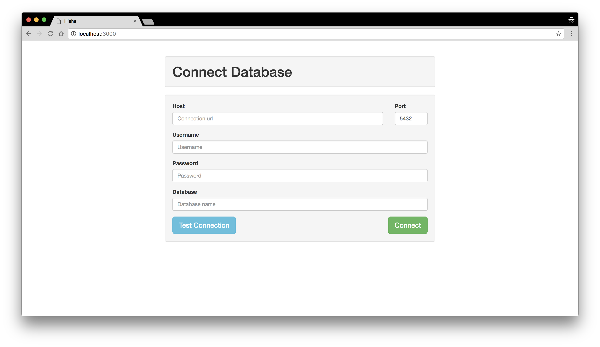
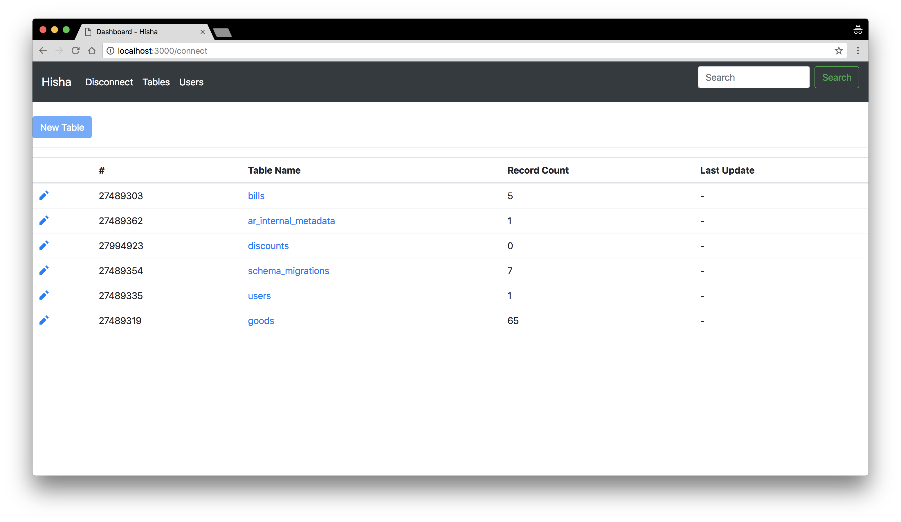

# Hisha

Hisha is cross-platform and web-based Postgre SQL Database client.

## Features

This project is inspired from Adminium and pgweb. These projects are cross platform postgres editors. The features are:

1. Cross-platform: Hisha is a web-based application. You can deploy it as a public website so that you can access it any where.
2. Click cell to edit: if you would like to edit/update a cell of a table, all you need to do is simply double click on the cell. The cell will get into editing mode.
3. Enter to save: once you finished your creation, you can simple press return/enter key on keyboard to save the update. Note that this action will commit your update to database if there is no error during update query.
4. No database required for this project: except the database you would like to connect to, there is no database integration required to deploy this project.
5. Schema independent: since there is no database integration in this project, you don't need to defined any schema for deployment.

But Adminium does not open as a public service but only be an add-on of heroku. pgweb is lack of saving data by press enter. Both of them do not provide user management.

## Usage

1. Download bundled source code or `git clone git@github.com:xshogi/hisha.git`.
2. Run `npm install` to install dependent modules.
3. Run `npm start` to run the server.
4. Connect to `localhost:3000` to view the portal for database connection.

Currently, Hisha only support connections (with TLS/SSL) by manually providing database host, user, password and database name. You can test your connection after you complete form. Once you connect to the database, all the tables of it will be listed.

## Introduction

There are two parts of this client.

1. API: in this part, Hisha defined logic of CRUD operation of Postgres SQL Database.
	- Tables management API	
	- User management API

2. UI: this is a web-base user interface for users to management the database, tables, and users
	- Database management
	- Table management
	- User management

This platform is targeting to provide two methods to manipulate Postgres SQL. One is native SQL string. You can use SQL syntax to do create, update, read and detele of data just like traditional database management softwares. The other way is WYSIWYG editors. For creating table, there is an HTML form for you to add new colume into schema and define the type, nullable, default value, and other properties. To update existed data entry, you can go into target table, simply select the cell of entry you would like to edit and double click the cell to edit. It's also easy to save the editing. All you need to do is press enter key or click check button. Then the JavaScript behind this base will make an Ajax request your API backend to finish the update operation.

## WIP ToDo List
- [] User management (create, update and remove user, grant access privillege)
- [] Create and drop table
- [] Improvement of table rows editing (check mark button for saving update)
- [] Table searching
- [] Row sorting and searching
- [] Testing
- [] Connecting via scheme (connection string)
- [] SQL execution support

## DevRef

* node-postgres - https://node-postgres.com/
* EJS - http://ejs.co/

## Contributing

Any new feature or improvement or bug fixing is welcome! 
Let's make this project more useful and powerful!

## License

Requesting advise.
